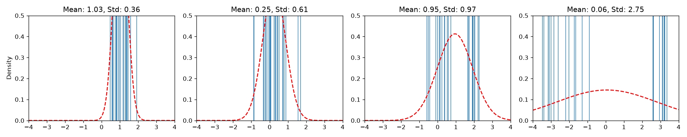
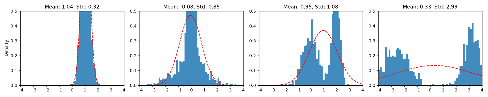

# Semantic Anarchy — chaos by design

> **Promptless image generation.** A faithful, hackable implementation of the
> early Eden.art / Abraham **"Semantic Anarchy: Chaos by design"** method — now
> running on **both Stable Diffusion 1.5 and SDXL** behind one `--backend` flag.

Normal text-to-image runs `text → CLIP text encoder → conditioning → UNet → image`.
The deck's move (slide 9): **X out the text encoder. "There is no prompt."**

```
   prompts.txt ──▶ CLIP text encoder ──▶ harvest conditioning c   (used ONCE, to mine the corpus)
                                              │
                                              ▼
                          learn a distribution p(c)  ──────────┐
                                              │                │  sample c ~ p(c)
        ✗ CLIP text encoder ✗  (bypassed at generation time)   │  drift it (temperature / sampler)
                                              ▼                ◀┘
                       UNet(prompt_embeds = c)  ──▶  image      (no linguistics: pure AI aesthetic)
```

<p align="center">
  
  
  <br><em>The mined cloud as an independent Gaussian per coordinate (slides 6–7):
  sparse "rug" vs dense histogram.</em>
</p>

## The idea

1. **Mine** — encode a wide corpus of ~1000 "good" prompts once and harvest their
   conditioning tensor(s). Learn that cloud's distribution.
2. **Sample & drift** — draw brand-new conditioning straight from the distribution
   and decode it. A `--temperature` knob and a `--sampler` choice control *where*
   you draw from (see below). The text encoder is never touched at generation time.
3. **Select & refit** — keep what scores well ("aesthetic resonance"), then fit a
   *new* distribution to the conditioning of the images you kept
   (`scripts/fit_selection.py`, no GPU needed) and sample that instead.

## One method, two models — `--backend {sd15, sdxl}`

The whole pipeline is model-agnostic once a model is described by its **named
conditioning tensors**. A small [`Backend`](semantic_anarchy/backend.py)
abstraction (`encode → fit → sample → generate`) makes the *identical* drift /
sweep / evolution logic run on either model — flip only `--backend` (+ the right
`--model`/`--ckpt`):

| backend | conditioning tensors | pipeline (stock diffusers) | default knobs |
|--------|----------------------|----------------------------|---------------|
| `sd15` | `embeds` `(77, 768)` | `StableDiffusionPipeline` | `--steps 30 --guidance 7.5` |
| `sdxl` | `prompt_embeds` `(77, 2048)` + `pooled` `(1280)` | `StableDiffusionXLPipeline` | turbo: `--steps 1 --guidance 0`; base: `--steps 30 --guidance 7` |

No SAE, no hooks, no forked diffusers — both backends use **stock** pipelines'
`prompt_embeds` / `pooled_prompt_embeds` arguments.

## The knobs

**`--temperature`** scales the whole deviation from the corpus mean.
`c = mean + temperature · deviation`. Low → near the bland, typical center; high →
out into the less-typical tails (chaos by design).

**`--sampler`** chooses *where on the anarchy ↔ coherence axis* a sample is drawn:

| sampler | what it does | interpolation vs extrapolation |
|---------|--------------|-------------------------------|
| `diagonal` | independent per-coordinate Gaussian (the deck's original model) | raw, off-manifold |
| `pca` | draw within the low-rank corpus subspace (real axes of variation) | **`temperature > 1` extrapolates coherently OUTSIDE the corpus hull** |
| `blend --coherence λ` | interpolate the diagonal & PCA covariances (`λ=1` pca, `λ=0` diagonal) | dial how far onto the manifold |
| `hybrid` | SLERP-fuse two real corpus embeddings (concept fusion) | stays inside the hull |
| `split --temp-on/--temp-off` | a diagonal draw cut into its PCA-subspace projection and the orthogonal remainder, each with its own temperature | the diagnostic: *which* half carries the good weirdness |

Four further knobs come from measuring where that model disagrees with the real
corpus — `--rho` (row coherence), `--length-mode`/`--length` (the past-EOS
content/padding split), `--empirical-head` (leading PCA coefficients from the
corpus's own CDF) and `--radius-band` (per-sample target radius). Each is off by
default, so the samplers above are unchanged unless you ask.
See [docs/reference/sampler-corrections.md](docs/reference/sampler-corrections.md).

`--components` (top-N principal axes), `--truncation` (typical-set clip),
`--neg-mode {text,mean,empty,zeros}` (the CFG negative branch; defaults to
`text` — the house SD1.5 negative prompt — on sd15 and `mean` — push away from
the average prompt toward the sample — on sdxl) and `--negative "..."` (that
negative prompt's actual words, also editable in the dashboard's Advanced
panel) round out the set. See
[docs/reference/negative-prompt.md](docs/reference/negative-prompt.md).

## Install

Python **3.12** (torch has no 3.14 wheels; 3.13 lags).

```bash
python3.12 -m venv .venv && . .venv/bin/activate
pip install -r requirements.txt        # core: math, plots, evolution, demo, tests
# full tier (render real images, either backend, stock diffusers):
pip install torch diffusers transformers accelerate safetensors
```

## Run

**Verifiable demo — no SD, no GPU** (synthetic embeddings, emits the slide 6/7 plots):

```bash
python scripts/demo_no_sd.py
```

**SD1.5** (single-file checkpoint, no HF download):

```bash
python scripts/mine_distribution.py --backend sd15 --ckpt ~/models/v1-5-pruned-emaonly.safetensors \
    --prompts prompts_1000.txt --out outputs/dist
python scripts/generate.py --backend sd15 --dist outputs/dist --n 8 --device mps
python scripts/temperature_sweep.py --backend sd15 --dist outputs/dist \
    --temps 0.5,1.0,1.5,2.0 --seeds 0,1,2
```

**SDXL** (same commands, only `--backend`/`--model` differ):

```bash
python scripts/mine_distribution.py --backend sdxl --model ~/models/sdxl-turbo \
    --prompts prompts_1000.txt --out outputs/dist
python scripts/generate.py --backend sdxl --dist outputs/dist --n 8 --device mps
# coherent drift OUTSIDE the hull (base SDXL + CFG lets extrapolation bite):
python scripts/temperature_sweep.py --backend sdxl --dist outputs/dist \
    --model ~/models/sdxl-base --sampler pca --temps 1,2,3,4 --steps 30 --guidance 7
```

**Latent travel films** — interpolate between images you already made and render
the walk as an x264 mp4. Every generated image keeps its exact conditioning in a
`.npz` sidecar, so a keyframe can be revisited: the film blends the conditioning
*and* the init noise (rebuilt from the recorded seed), which makes frame 0 and
frame N pixel-identical to the keyframes and everything between brand new.

```bash
python scripts/morph_film.py --name driftA --refine none \
    --images generated/anarchy_sd15_A_000.jpg generated/anarchy_sd15_B_001.jpg \
    --frames-per 24 --fps 16 --interp slerp --easing smooth --loop
# -> outputs/films/driftA/driftA.mp4 (+ base/ frames + film.json)
```

A film has **one** resolution — keyframe 1's own, or `--width/--height`. A keyframe
made at a different size is re-rendered at the film's size from a differently-shaped
noise draw, so it is *not* reproduced exactly; the script names every such keyframe
before it starts.

In the dashboard this is the **🎬 Timeline** tab: hit 🎬 on any image to add it
as a keyframe, drag the keyframes into the order you want, set fps / frames-per-hop
/ interpolation, and render — the mp4 plays inline in the 🎞 Films tab. Mixed
backends or mixed resolutions are flagged there before you spend the GPU time.

`prompts_1000.txt` is a wide, deterministic "good" corpus you can regenerate with
`python gen_prompts.py`. Distributions are saved backend-namespaced (`sd15` keeps
`outputs/dist`; `sdxl` writes `outputs/dist_sdxl__*`), so the two never clash.

## Structure

```
semantic_anarchy/
  distribution.py   EmbeddingDistribution — fit/sample/interpolate/project/evolve (pure numpy)
  backend.py        Backend abstraction — sd15 (1 tensor) / sdxl (2); encode/fit/sample/generate
  pipeline.py       SDModel (SD1.5) + SDXLModel (SDXL) — stock diffusers, lazy torch import
  cli_args.py       shared --backend argparse wiring + per-family defaults
  travel.py         keyframe films — slerp/lerp, easing, frame schedule (pure numpy)
  viz.py · aesthetic.py · evolve.py · cli.py
scripts/
  mine_distribution.py · generate.py · temperature_sweep.py · sampler_sweep.py
  explore.py            local navigation around an existing image
  fit_selection.py      refit a distribution on the latents of images you picked
  morph_film.py         latent travel through keyframes -> x264 mp4
  explore_session.py    unattended time-budgeted gallery
  demo_no_sd.py         the torch-free demo
tests/                  pytest — distribution + evolution + backend abstraction (all torch-free)
```

Everything that doesn't strictly need a GPU is pure NumPy; torch/diffusers are
imported lazily, so the math, plots, evolution loop and the **whole test suite run
with neither installed**.

## Models not included

Model weights are **not** committed (Stability AI licenses; large). Get them yourself:

- **SD1.5** — a single-file `v1-5-pruned-emaonly.safetensors` (Hugging Face /
  Civitai), passed via `--ckpt`. No HF download needed.
- **SDXL** — `stabilityai/sdxl-turbo` or `stabilityai/stable-diffusion-xl-base-1.0`
  (e.g. `huggingface-cli download … --local-dir ~/models/…`), passed via `--model`.

## Test

```bash
pytest -q
```

Covers: fit recovers known mean/std; sampling shapes + temperature scaling; PCA
extrapolation (no clipping); save/load round-trip; the backend abstraction
(sd15/sdxl two-tensor fit/sample, sampler dispatch); evolution raising the mean
score on an analytic objective; and the film trajectory math (interpolation
endpoints, easing curves, frame schedule, noise window).

## License

MIT — see [LICENSE](LICENSE).
